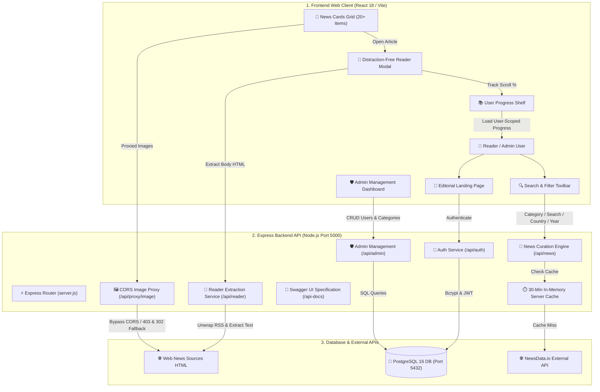
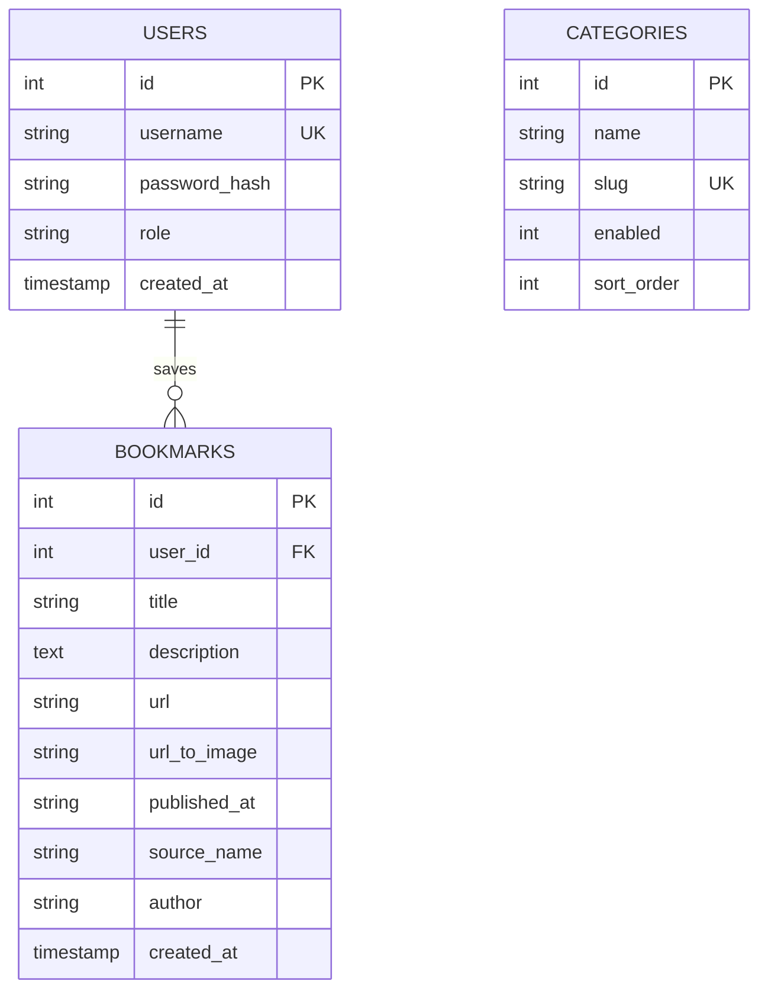

# 📰 The Daily Wire — Full-Stack News Aggregator & Reader Platform
## 🛠️ Complete System Architecture & Technical Documentation

---

## 📌 1. Executive Summary

**The Daily Wire** is a modern, publication-grade digital news publishing and aggregation platform. It integrates live global headlines from over 10,000+ verified worldwide sources, provides an in-app distraction-free **Reader Mode**, tracks e-reader style **Reading Progress (0%–100%)** per user account, supports **Night Mode** across all views, and features an interactive **OpenAPI / Swagger 3.0 API Documentation** suite backed by **PostgreSQL 16**.

---

## 🏗️ 2. Technology Stack & Infrastructure

| Layer | Technologies & Libraries | Function / Role |
|---|---|---|
| **Frontend UI** | React 18, Vite, Lucide Icons, Vanilla CSS Design System | High-performance SPA with responsive newspaper & dark themes |
| **Backend API** | Node.js (v20), Express.js, JWT, Bcrypt.js | RESTful API server, rate limiting, and business logic |
| **Database** | PostgreSQL 16 (`pg` pool) | Relational database with automatic SQL parameter conversion |
| **Article Extractor** | `@extractus/article-extractor` | Strips ads, popups, paywalls, and unwraps Google News RSS links |
| **Documentation** | `swagger-ui-express`, `swagger-jsdoc` | Interactive OpenAPI 3.0 documentation suite at `/api-docs` |
| **Containerization** | Docker, Docker Compose, Nginx (Alpine) | Multi-container production deployment (`frontend`, `backend`, `postgres`) |

---

## 🏛️ 3. End-to-End System Architecture



---

## 🗄️ 4. Database Schema & Entity Relationship Diagram

### Entity Relationship Diagram (ERD)



### Table Definitions

1. **`users`**:
   - `id`: `SERIAL PRIMARY KEY`
   - `username`: `VARCHAR(255) UNIQUE NOT NULL`
   - `password_hash`: `TEXT NOT NULL`
   - `role`: `VARCHAR(50) DEFAULT 'user'` (*'admin'* or *'user'*)
   - `created_at`: `TIMESTAMP DEFAULT CURRENT_TIMESTAMP`

2. **`bookmarks`**:
   - `id`: `SERIAL PRIMARY KEY`
   - `user_id`: `INTEGER REFERENCES users(id) ON DELETE CASCADE`
   - `title`: `TEXT NOT NULL`
   - `description`: `TEXT`
   - `url`: `TEXT NOT NULL`
   - `url_to_image`: `TEXT`
   - `published_at`: `VARCHAR(100)`
   - `source_name`: `VARCHAR(255)`
   - `author`: `VARCHAR(255)`
   - `created_at`: `TIMESTAMP DEFAULT CURRENT_TIMESTAMP`
   - `UNIQUE(user_id, url)` *(Prevents duplicate bookmarking per user)*

3. **`categories`**:
   - `id`: `SERIAL PRIMARY KEY`
   - `name`: `VARCHAR(100) NOT NULL`
   - `slug`: `VARCHAR(100) UNIQUE NOT NULL`
   - `enabled`: `INTEGER DEFAULT 1` *(1 = Active, 0 = Disabled)*
   - `sort_order`: `INTEGER DEFAULT 0`

---

## 🔌 5. API Reference Specifications

| Method | Endpoint | Access | Description |
|---|---|---|---|
| `POST` | `/api/auth/register` | Public | Registers a new user account & returns 7-day JWT token |
| `POST` | `/api/auth/login` | Public | Authenticates credentials & returns JWT token |
| `GET` | `/api/auth/me` | User | Fetches current user profile from JWT token |
| `GET` | `/api/news` | Public | Aggregates news with category, search, country & year filters |
| `GET` | `/api/categories` | Public | Fetches enabled categories list |
| `GET` | `/api/bookmarks` | User | Fetches saved articles for authenticated user |
| `POST` | `/api/bookmarks` | User | Saves an article bookmark |
| `DELETE`| `/api/bookmarks/:id` | User | Removes a bookmarked article |
| `GET` | `/api/reader?url=...` | Public | Extracts full article body HTML & unwraps RSS redirects |
| `GET` | `/api/proxy/image?url=...` | Public | Proxies images with Chrome headers & 302 Unsplash fallback |
| `GET` | `/api/admin/stats` | Admin | Fetches system overview statistics (users, bookmarks, categories) |
| `GET` | `/api/admin/users` | Admin | Lists all registered users with bookmark counts |
| `PATCH` | `/api/admin/users/:id/role` | Admin | Promotes or demotes user account role (`admin` ↔ `user`) |
| `DELETE`| `/api/admin/users/:id` | Admin | Deletes a user account |
| `POST` | `/api/admin/categories` | Admin | Adds a new news category |
| `PUT` | `/api/admin/categories/:id` | Admin | Updates or enables/disables a category |

> 📜 **Interactive Swagger UI**: Hosted live at **`http://localhost:5000/api-docs`**.

---

## ⚙️ 6. Core Modules & Technical Deep-Dive

### 1. Dual-Database Engine Adapter (`backend/db.js`)
- **Universal SQL Translator**: Converts SQLite-style positional parameters (`?`) into PostgreSQL positional parameters (`$1, $2, $3`) dynamically.
- **SQL Statement Adapter**: Translates SQLite `INSERT OR IGNORE INTO` into PostgreSQL `INSERT INTO ... ON CONFLICT DO NOTHING`.
- **Primary Key Return**: Appends `RETURNING id` to `INSERT` statements under PostgreSQL so newly generated IDs are returned cleanly.
- **Sequence Generator Reset**: Automatically executes `SELECT setval(...)` after migrations to prevent primary key sequence collisions.

### 2. Multi-Tier News Engine & 20+ Items Pagination (`backend/routes/news.js`)
- **Category Curation**: Fetches top headlines across 8 standard & custom categories (*General, Technology, Business, Finance, Defence, Science, Health*).
- **Automatic Multi-Page Fetching**: Follows NewsData.io's `nextPage` token automatically to fetch Page 1 + Page 2, providing **20+ articles per category**.
- **30-Minute In-Memory Server Cache**: Stores normalized responses to keep API response times under **10ms** and conserve external API rate quotas.

### 3. Distraction-Free Reader Mode & CORS Image Proxy
- **Reader Extractor (`routes/reader.js`)**: Parses article URLs using `@extractus/article-extractor` to unwrap Google News RSS links and strip out ads, popups, and paywalls.
- **CORS Image Proxy (`routes/imageProxy.js`)**: Bypasses HTTP 403 Forbidden and CORS headers using Chrome 122 User-Agent headers. Automatically redirects to curated Unsplash placeholders on 404 or image loading timeouts.

### 4. User-Scoped Reading Progress Engine
- **Kindle-Style Scroll Tracker**: Calculates real-time reading completion in `ArticleModal.jsx`:
  $$\text{Progress \%} = \frac{\text{Scroll Position}}{\text{Total Height} - \text{Screen Height}} \times 100$$
- **Account Isolation**: Stores progress keys scoped to user IDs (`progress_userId_url`), ensuring each account retains its own private reading list.
- **Formatted Card Badges**:
  - In Progress: `🕒 68% Read` with a smooth 5px progress bar track.
  - Completed: `✓ 100% Completed` with a green status badge.

### 5. Night Mode Theme Engine
- **Dynamic CSS System**: Uses CSS variables mapped to `body.dark-theme` for instant 1-click theme switching across all pages.
- **Persistence**: Remembers theme preference in `localStorage` (`news_app_theme`).

---

## 🐳 7. Docker Deployment Guide

### Deployment Architecture
The multi-container setup (`docker-compose.yml`) deploys 3 isolated production containers:

1. **`news_frontend`**: React production build served via Nginx Alpine on Port **`80`**.
2. **`news_backend`**: Node.js Express API server on Port **`5000`**.
3. **`news_postgres`**: PostgreSQL 16 database instance on Port **`5432`**.

### One-Command Deployment

```bash
# 🚀 1. Build and start all 3 containers in background
docker compose up -d --build

# 📊 2. Check running container status
docker compose ps

# 🛑 3. Stop containers
docker compose down
```

---

## 🌐 8. Live Access Endpoints

- 📱 **Web Application**: **[http://localhost](http://localhost)** *(or `http://localhost:5173` in local dev)*
- ⚡ **Express REST API**: **[http://localhost:5000/api/categories](http://localhost:5000/api/categories)**
- 📜 **Swagger API Documentation**: **[http://localhost:5000/api-docs](http://localhost:5000/api-docs)**
